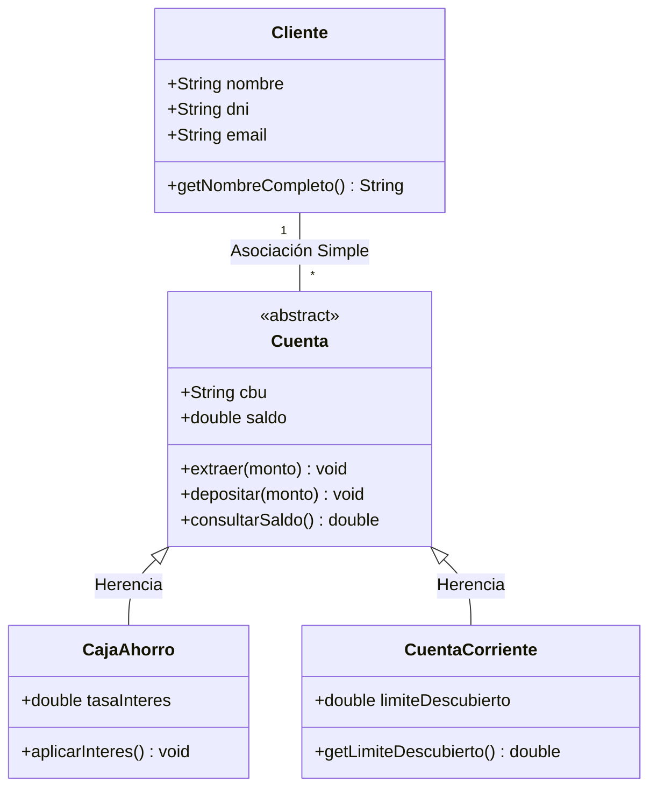

# Trabajo Práctico: Sistema Bancario Básico (POO + Spring Boot)

## 1. Objetivos de Aprendizaje

Al finalizar este trabajo práctico, serás capaz de:

- Modelar un sistema aplicando los cuatro tipos de relaciones fundamentales de la Programación Orientada a Objetos: **herencia**, **asociación**, **composición**, **agregación** y **dependencia**.
- Leer, interpretar y completar un diagrama de clases UML.
- Implementar una API REST con **Spring Boot** que exponga endpoints de tipo **GET**.
- Manejar la persistencia de datos en memoria mediante listas dentro de las clases de servicio.

---

## 2. Contexto del Proyecto

¡Bienvenido al equipo de desarrollo del **Banco UNLaR**! Somos un banco nuevo que necesita armar su sistema desde cero. Por el momento tenemos un diseño muy básico que apenas nos permite registrar clientes y abrir cajas de ahorro o cuentas corrientes.

Tu objetivo será tomar este diseño inicial como **punto de partida**, analizarlo, y luego **completarlo** agregando nuevas clases y relaciones que satisfagan los requerimientos que el banco nos ha pedido. ¡Manos a la obra!

---

## 3. Diagrama UML Parcial (Punto de Partida)

El siguiente diagrama representa el núcleo de nuestro sistema. **Está incompleto a propósito**. Parte de tu trabajo será extenderlo con las nuevas clases y relaciones que diseñes.



> **Nota importante:** El diagrama anterior solo muestra la herencia entre las cuentas y la asociación simple entre Cliente y Cuenta. **Falta todo lo demás**. En la siguiente sección te explicamos qué debés agregar.

---

## 4. Desafío de Diseño (Paso a Paso)

A continuación se describen tres nuevas funcionalidades que el banco necesita. Para cada una, deberás crear la clase correspondiente y decidir **qué tipo de relación** la une con las clases ya existentes. También deberás decidir qué atributos y métodos lleva cada clase nueva. **Usá tu criterio de diseño**.

### 4.1. Composición: Historial de Movimientos

El banco quiere que cada cuenta bancaria tenga un **historial de movimientos**. Cada movimiento debe registrar:

- `fecha` (LocalDate): día en que se realizó.
- `monto` (double): valor de la operación.
- `detalle` (String): descripción de la operación (ej. "Depósito en ventanilla", "Extracción en cajero").

**Regla de negocio:** Los movimientos son parte exclusiva de una cuenta. Si una cuenta se elimina del sistema, todos sus movimientos deben desaparecer con ella. No puede existir un movimiento sin una cuenta que lo contenga.

> **Tu tarea:** Creá la clase `Movimiento` y establecé una relación de **composición** con `Cuenta`. Dibujá esta relación en tu diagrama UML.

### 4.2. Agregación: Sucursales del Banco

El banco opera en distintas ubicaciones físicas. Necesitamos representar cada **sucursal** con los siguientes datos:

- `nombre` (String): nombre identificatorio de la sucursal.
- `direccion` (String): domicilio físico.

Cada sucursal agrupa a varios **clientes**. Sin embargo, hay una diferencia importante con la composición: **si una sucursal cierra, los clientes no desaparecen**, simplemente quedan registrados en el banco y pueden ser reasignados a otra sucursal.

> **Tu tarea:** Creá la clase `Sucursal` y establecé una relación de **agregación** con `Cliente`. Dibujá esta relación en tu diagrama UML.

### 4.3. Dependencia: Cajero Automático

El banco instalará **cajeros automáticos** en todas sus sucursales. Cada cajero debe poder realizar una operación muy simple: **consultar el saldo** de cualquier cuenta.

La clase `CajeroAutomatico` debe tener:

- `ubicacion` (String): dónde está instalado físicamente.
- Método `consultarSaldo(Cuenta cuenta)`: recibe un objeto `Cuenta` como parámetro, lee su saldo y lo devuelve.

**Diferencia clave:** El cajero **usa** la cuenta momentáneamente para consultar el saldo, pero **no la guarda como atributo propio**. La cuenta se pasa como parámetro, se usa, y se descarta. Esta es una relación de **dependencia**: el cajero depende de la cuenta solo durante la ejecución de ese método.

> **Tu tarea:** Creá la clase `CajeroAutomatico` y establecé una relación de **dependencia** con `Cuenta`. Dibujá esta relación en tu diagrama UML (recordá que en UML la dependencia se dibuja con una flecha punteada `- - - - >`).

---

## 5. Requerimientos de Implementación

### 5.1. Tecnología

- **Lenguaje:** Java 17 o superior.
- **Framework:** Spring Boot (Spring Web).
- **Gestor de dependencias:** Maven o Gradle (a elección).
- **Persistencia:** **Listas en memoria** (`ArrayList`, `LinkedList`, etc.) dentro de las clases de servicio.

### 5.2. Estructura de Paquetes Sugerida

```
com.banco.unlar
├── models          (Clases del dominio: Cuenta, CajaAhorro, CuentaCorriente, Cliente, Movimiento, Sucursal, CajeroAutomatico)
├── services        (Lógica de negocio y listas en memoria)
└── controllers     (Endpoints REST)
```

### 5.3. Restricción de Endpoints

**Solo se deben implementar endpoints de tipo GET.** El objetivo de este TP es aprender a exponer datos, no a modificarlos. La API será de solo lectura sobre datos pre-cargados.

### 5.4. Datos Pre-cargados

Antes de que la aplicación levante, los servicios deben cargar en sus listas al menos:

- **2 sucursales** con algunos clientes cada una.
- **3 clientes** en total, cada uno con al menos una cuenta.
- **2 cuentas** que tengan algunos movimientos registrados en su historial.

Esto se puede hacer desde el método `main` o mediante una clase de configuración con `@PostConstruct`.

---

## 6. Endpoints GET Obligatorios

| Método | Ruta                              | Descripción                                                      | Respuesta Esperada                                          |
|--------|-----------------------------------|------------------------------------------------------------------|-------------------------------------------------------------|
| GET    | `/sucursales/{id}/clientes`       | Devuelve la lista de clientes asociados a una sucursal específica. | JSON con los datos de cada cliente (nombre, DNI, email).    |
| GET    | `/clientes/{dni}/cuentas`         | Devuelve las cuentas bancarias de un cliente y el saldo de cada una. | JSON con los datos de cada cuenta (CBU, tipo, saldo).       |
| GET    | `/cuentas/{cbu}/movimientos`      | Devuelve el historial completo de movimientos de una cuenta.      | JSON con fecha, monto y detalle de cada movimiento.         |

---

## 7. Criterios de Evaluación

| Criterio                         | Puntaje |
|----------------------------------|:------:|
| Diagrama UML completo y correcto (herencia, asociación, composición, agregación y dependencia bien representadas). | 30% |
| Código Java compila y ejecuta sin errores. | 15% |
| Las relaciones de POO están correctamente implementadas en el código (ej. composición = la cuenta crea y destruye sus movimientos). | 25% |
| Endpoints GET funcionan correctamente y devuelven los datos esperados. | 20% |
| Datos pre-cargados presentes y coherentes. | 10% |
| **Total**                        | **100%** |

---

## 8. Formato de Entrega

Entregar un repositorio que contenga:

1. **Diagrama UML** en formato imagen (`.png` o `.jpg`) o como archivo `.md` con sintaxis de Mermaid.
2. **Código fuente** del proyecto Spring Boot completo (sin la carpeta `target` ni archivos compilados).
3. **Captura de pantalla** de cada endpoint funcionando (puede ser desde el navegador, Postman o `curl`).

---

## 9. Consejos Finales

- **Empezá por el UML.** Si el diagrama está bien pensado, la implementación en código será mucho más clara.
- **Probá los endpoints con el navegador** apenas levante la aplicación. Si ves un JSON con los datos esperados, vas por buen camino.
- **No te compliques con la persistencia.** `ArrayList` y algunos datos cargados a mano en el `main` son más que suficientes.
- **Si tenés dudas sobre las relaciones**, volvé a leer la sección 4. Ahí está todo explicado paso a paso.

¡Mucha suerte, futuro/a desarrollador/a del Banco UNLaR!
